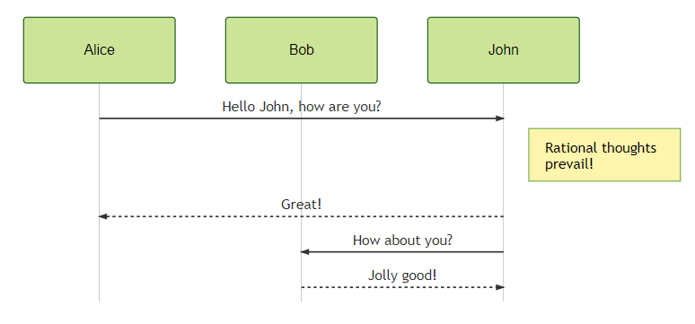

_This is my blog. I'll post about random developer stuff._

<!-- template:
_________________________________

// two ## are needed for permalink
## Title... :emoji:
###### Published on 2019-xx-xx.

Text

<small><strong>[Comment this post!](https://github.com/glae/blog/issues/new?title=Comment%20on%202019-xx-xx%20post&assignee=glae)</strong></small><br><br>

-->


<!--
## To develop = to code, right? :label:
###### Published on 2019-10-18.

### "You code all day long"

I have mixed feelings about programming languages. Non-IT or non-developer people tend towards thinking a dev job is **all about programming**. And that programming language `X` is better than `Y` for `R1` or `R2` reason (or `FA` or `FB` framework). In my own experience, they are mostly wrong. My job includes, in a non-exhaustive fashion, several different actions: 
- to communicate: about everything (feature, bug, infrastructure, UI, UX, design) with everyone (product owner, manager, dev, architect, designer, ops) with every tool (real contact, phone, chat, email, document) 
- to design: a system, an architecture, an API, some interactions (usually it requires some people standing in front of a whiteboard)
- to implement: development (in `X` or `Y` language), testing, deployment, configuration, review
- to "bureaucrate", e.g.: budget/holidays reporting for management, JIRA/Trello/Aptana/board updates, ticket to ask for a new database

### From a wider sight

I see the same conflation in the french public education, our (so-called) specialists say:
> Kids should learn at school coding/how to program.

I am confused. I think kids should really see the whole picture and grow a digital culture, by learning and understanding our digital world in its countless fields: privacy, cloud, GAFAM, banking, internet, networks, social media...

For those who say:
> These bunch of developers, they just have ["to shit code"](http://www.quickmeme.com/img/7c/7c0cc2ef5055864b867487205e7e8b08f0776077fd1570149809119163a4a15a.jpg).

I would moderate this previous statement: they communicate, design, implement and bureaucrate.

We see every year or semester, the "trendy top languages" news, like the famous [TIOBE index](https://www.tiobe.com/tiobe-index/). I have been introduced to programming since 17 years now (woah!). I found it could be fun to write my own programming languages (I exclude declarative ones) timeline usage. `X`, `Y` or `Z` languages do not seem to matter that much in the end. 

gantt 
title Programming languages I can or could write
dateFormat  YYYY-MM

section Fluent
JavaScript      :active, 2002-01,2019-01
Java               :active, 2002-01,2019-09
Bash               :active, 2003-01,2019-09

section Rusty
    PHP                :done, 2003-01, 2004-01
    PHP                :done, 2018-11, 2018-12
    C                    :done, 2004-01,2006-01

    Visual Basic     :done, 2005-05,2005-08
    Python            :active, 2006-05,2006-08
    C♯                  :active, 2006-05,2006-08
    Ada                :active, 2006-05,2006-08
    Occam            :active, 2006-05,2006-08
    C++                :active, 2006-05,2006-08
    Objective C  :active, 2006-05,2006-08
    Swift  :active, 2006-05,2006-08
    ActionScript: 
Scala  :active, 2006-05,2006-08
TypeScript  :active, 2006-05,2006-08
   


<small><strong>[Comment this post!](https://github.com/glae/blog/issues/new?title=Comment%20on%202019-10-18%20post&assignee=glae)</strong></small><br><br>

-->


## My dream ASCII company :page_with_curl:
###### Published on 2019-10-16.

I wish I work in a company that use [ASCII](https://en.wikipedia.org/wiki/ASCII) or plain text as a primary format for its written work. 

### Why?

There are many reasons why, but here is for me the three main ones:
1. beauty: people working in IT mostly **do** suck at making pretty content or documents, so plain text prevent people trying to do so (ASCII art have limits)
1. simplicity: splitting the form and substance (or the style and content) keeps things simple ([KISS](https://en.wikipedia.org/wiki/KISS_principle))
1. money: ASCII/plain text is just free! 

Here is my personal experience with all of these. 

#### 1999 - Plain text

I started writing my diary in 1999. It was all plain text files ending with `.txt`. It is still readable: 
```
Let's have a fun in my castle
To see the sunshine people
```
There was an obscure 30 KB size limit on my computer at the time.  

#### 2006 - LaTeX + Beamer

During my computer science degree, I had to write another thesis. I was used to use Word or OpenOffice for this kind of stuff, but a classmate introduced me to this weird-case-titled-document-system called [LaTeX](https://en.wikipedia.org/wiki/LaTeX) (pronunciation is under debate as in GIF or [MySQL](https://dev.mysql.com/doc/refman/5.7/en/what-is-mysql.html)).

I immediately felt in love with it... Well, until I had to include figures and tables in my document. Here is a sample content: 
```latex
\chapter{Schedulability}

	The development of an embedded real-time application supposes that it needs to be 
    scheduled. First, we know that scheduling is based on three components:
	\begin{itemize}
		\item[-] an algorithm for allocating the resources \emph{(scheduling mechanism)}
		\item[-] an algorithm for ordering access to resources \emph{(scheduling policy)}
		\item[-] a means of predicting the worst-case behavior of the system when the 
        policy and mechanism are applied \emph{(schedulability analysis)}
	\end{itemize}

\section{Assessment}
\subsection{Scheduling mechanism}

We will use the Fixed Priority Scheduling (FPS) mechanism in a preemptive scheme for 
this purpose, a common way to schedule real-time systems. A static-priority algorithm 
assigns all priorities at design time, and those priorities remain constants for 
the lifetime of the task : we are in this case~\cite{LiuLay73}. 
```
Any text editor can be used (vi, Emacs, Notepad, Atom, Visual Studio Code...) or there are also [many dedicated editors](https://en.wikipedia.org/wiki/Comparison_of_TeX_editors).  

And the rendered output PDF:
<br>


I also tried to use LaTeX with its presentation mode, [Beamer](https://github.com/josephwright/beamer), and created clean PDF presentations with source like: 
```latex
\begin{frame}
\frametitle{Use-cases and tasks}

\begin{block}{A task}
\begin{itemize}
  \item is an entity of an use-case
  \item encapsulates an object with \texttt{in} and \texttt{out} \emph{ports} to communicate
  \item has some temporal attributes:
  \begin{itemize}
    \item static ones: MAXTC, MINTC
    \item context-dependant ones: release time, deadline
  \end{itemize}
\end{itemize}
\end{block}

\end{frame}
```
And the rendered presentation:
<br>


Nowadays HTML alternatives like [Reveal.js](https://github.com/hakimel/reveal.js), which can include Markdown format also seem to be good solutions.

#### 2008 - Wikis

In my first jobs and still today, as a developer I am using wikis every day. Like Wikipedia, they are useful for various situations: machine setup guide, welcome instructions, user stories collection, etc. 

Each wiki engine (Trac, MediaWiki, XWiki, Confluence) comes with [some markup templating syntax](https://en.wikipedia.org/wiki/Lightweight_markup_language) (Creole, MediaWiki markup, Textile...). I remember some colleagues wanting to configure a [WYSIWYG](https://en.wikipedia.org/wiki/WYSIWYG) editor... to get a "Word editor feeling" in their web browser, and to get stuck on the same content/style mix issues as well. 

#### 2011 - Markdown + AsciiDoc

Plain-text documentation files can today be found everywhere, particularly in the basecode itself, to try to keep documentation close to its code. Markdown variants and AsciiDoc are now very common and are easier to use than LaTeX syntax and targetting primarly HTML output. 

- every UNIX tools (`diff`, `tail`, `grep`, `git`) works fine with these formats (you can follow [french law evolutions](https://github.com/lexlib) on GitHub!)
- On GitHub, every decent open source project has its `README.md` or `README.adoc` file 

#### Next steps

I am considering using ASCII even for diagrams, for the same reasons above: simplicity, maintenance, openness. Some people are using *"doc as code"* to describe the whole mindset. There are many tools (Mermaid, PlantUML, [Kroki](https://kroki.io/)), with Mermaid for instance:


renders as PNG (but it could be SVG, which is... well, plain text!): 
<br>



### Excel, Pages, Word, PowerPoint, LibreOffice: really, why not?

Spend time setting up the style and its consistency, using unfriendly slow proprietary version system disturb me from what is important: **producing and maintaining content**.

I, however, admit tools like Google docs or Sharepoint can be nice to quickly collaborate with non-developers, but still lack plain-text straightforward simplicity.


<small><strong>[Comment this post!](https://github.com/glae/blog/issues/new?title=Comment%20on%202019-10-16%20post&assignee=glae)</strong></small><br><br>


## Tech skills: necessary but not sufficient :no_mouth:
###### Published on [2019-08-29](https://xkcd.com/1179/).

I often see this [learning roadmap link](https://github.com/kamranahmedse/developer-roadmap). It is a nice start for anyone who wants to learn or to improve its development skills. 

However, [as someone mentioned this issue](https://github.com/kamranahmedse/developer-roadmap/issues/40), we lack of some social skills developer roadmap. All these really nice tech skills are useless without the ability to promote and argue about your technical choices and approaches. 

<small><strong>[Comment this post!](https://github.com/glae/blog/issues/new?title=Comment%20on%202019-08-29%20post&assignee=glae)</strong></small><br><br>
